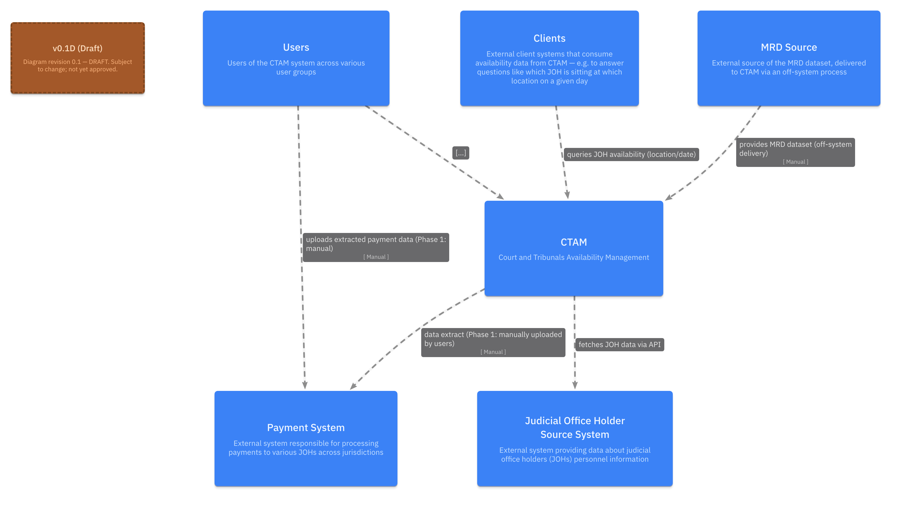

# CTAM — Integration Design Document (High Level)

> **Status:** v0.1 DRAFT — not yet ratified. Aligns with system context diagram revision **v0.1D (Draft)**. Not to be used for downstream decisions until ratified (see Document control).

| | |
|---|---|
| **Document owner** | _[Placeholder: name / role]_ |
| **Author(s)** | _[Placeholder]_ |
| **Last updated** | 2026-06-16 |
| **Related model** | LikeC4 source model `architecture/tobe/ctam-architecture.c4` |

---

## Document control

### Version history

| Version | Date | Author | Summary |
|---|---|---|---|
| v0.1 | 2026-06-16 | _[Placeholder]_ | Initial high-level draft. |

### Approvals / sign-off

| Role | Name | Decision | Date |
|---|---|---|---|
| Document owner | _[Placeholder]_ | — | — |
| Technical governance / design authority | _[Placeholder]_ | — | — |
| Integrating-system owner(s) | _[Placeholder]_ | — | — |

> **TODO:** Capture approvals before this document is treated as ratified.

### Distribution

_[Placeholder: distribution list]_ — e.g. CTAM design & delivery team; owning teams of the integrating systems (JOH Source System (eLinks), MRD Source, Payment System, client systems); technical governance board.

---

## Background — what CTAM is (product view)

**CTAM (Court and Tribunals Availability Management)** is the system used to plan and manage **when and where judicial office holders (JOHs) sit**. Its product goal is to ensure the right judicial resource is available at the right venue on the right day, across jurisdictions (**Tribunals**, **Courts**, and — in a future stage — **Magistrates**).

From a product perspective, CTAM:

- maintains **JOH personnel information**, sourced from the JOH Source System (eLinks);
- lets HMCTS users **plan itineraries** and allocate JOHs / panel members to venues, including ad-hoc and urgent court business;
- captures **JOH availability** — updated by JOHs / panel members themselves, or by HMCTS admins on their behalf;
- manages **absences** and the **vacancies** they create, **working patterns**, and **jurisdiction split**;
- supports **fee / payment** data extraction for finance teams; and
- **exposes JOH availability** to external client systems (e.g. which JOH is sitting at which location on a given day).

Confirming a sitting in CTAM is the event that enables a JOH to be **paid**. CTAM is delivered in stages, beginning with **SSCS**, the first Tribunal sub-jurisdiction (see §2).

---

## 1. Purpose & scope

This document describes, **at a high level**, the integrations between CTAM and the external systems and user groups it exchanges data with. It is intended for **technical governance and the owning teams of the integrating systems**, to establish a shared understanding of:

- which systems exchange data with CTAM, and in which direction;
- the mechanism, ownership and current delivery phase of each integration;
- the responsibilities of each owning team.

**Direction is stated by which end CTAM is on:**

- **Inbound** — CTAM is on the receiving end: it ingests data from a source system, *or* it hosts the API that an external party calls into.
- **Outbound** — CTAM is on the sending end: it produces data that is sent out to an external system.
- **Interactive** — users acting through the CTAM user interface.

> Client systems are classified **inbound** even though they *consume* CTAM data, because they call into a CTAM-hosted API — CTAM is on the receiving end of the request. The availability data CTAM returns flows back outward in the response.

**In scope:** the system-to-system data feeds and the primary user/UI interaction shown in the CTAM system context.

**Out of scope:** internal CTAM component design, detailed data contracts, field-level mappings (see References), and non-functional sizing — these are captured in dedicated artefacts or marked as TODO below.

> **TODO:** Confirm scope boundaries with governance — in particular whether Magistrates-jurisdiction integrations (currently TBD) should be tracked here or in a separate document.

## 2. Delivery context

CTAM is delivered in stages, **Tribunals first**. Within Tribunals, the sub-jurisdictions are delivered in the order **SSCS → ET → IAC**. **Phase 1 delivers SSCS** — the first Tribunal sub-jurisdiction. Integration availability and cadence may differ by phase / jurisdiction.

> **TODO:**
> - Define the later phases — how ET, IAC, Courts and Magistrates map to phase numbers.
> - Note any integration that is specific to a later phase or jurisdiction.
> - Record the current deployment / live state of each integration (none is yet confirmed live in production; see §6 Environments).

## 3. System context

The high-level system context below is the primary overview of CTAM's external integrations and the source this document elaborates on (currently at draft revision v0.1D). It is generated from the LikeC4 model and should be regenerated when that model changes (see References).

*Figure 1 — CTAM System Context (v0.1D Draft).*

For the internal container/component view that these integrations connect into, see the **CTAM Containers** diagram.

## 4. Integration summary

| # | Integration | Direction | Counterparty role | Mechanism | Phase / status |
|---|---|---|---|---|---|
| 1 | **JOH Source System (eLinks)** | Inbound | Supplies JOH personnel data | API (scheduled fetch) | _[Placeholder: phase]_ |
| 2 | **MRD Source** | Inbound | Supplies the MRD dataset | Off-system delivery (manual) | _[Placeholder: phase]_ |
| 3 | **Client systems** | Inbound | Consumes JOH availability (queries CTAM) | API (read-only, client-initiated) | _[Placeholder: phase]_ |
| 4 | **Payment System** | Outbound | Consumes payment extract | Manual upload | Phase 1 (SSCS) — manual |
| 5 | **Users ↔ CTAM UI** | Interactive | Manage sittings / view data | Web UI | _[Placeholder: phase]_ |

> **Note on naming:** the system context model names the inbound personnel system **"Judicial Office Holder Source System"**. This document refers to it consistently as **"JOH Source System (eLinks)"** (backed by JHR — Judicial HR). They are the same external system.

## 5. Integration profiles

Each integration is profiled against a standard set of attributes. Unknowns are marked `TODO` for the owning team to complete.

### 5.1 JOH Source System (eLinks) — Inbound

Supplies judicial office holder (JOH) personnel information. CTAM's **JOH Data Scheduler** fetches data via API and persists the raw payload to the **JOH Raw Payload Store**; the **JOH Data Reader** then reads the raw payload and sends personnel information to the **JOH Management API**, which persists it to the CTAM database.

| Attribute | Value |
|---|---|
| Direction | Inbound (source → CTAM) |
| Source → Target | JOH Source System (eLinks) → CTAM (JOH Data Scheduler → JOH Raw Payload Store → JOH Data Reader → JOH Management API → CTAM Database) |
| Mechanism | Scheduled API fetch; raw-then-refined persistence |
| Data domain | JOH personnel data (people, appointments, judiciary roles, authorisations, reference data) |
| Format | JSON payload |
| Frequency | _[Placeholder]_ — **TODO:** confirm schedule/cadence |
| Volume | **TODO:** expected record counts / payload size |
| Security / auth | **TODO:** API authentication, transport, network path |
| Counterparty owner | **TODO:** JOH Source System (eLinks) owning team contact |
| Detailed design | Companion pages: **JO (eLinks) — CTAM ER Diagram** and **JO (eLinks) — CTAM Schema & Source Mapping** |
| Phase / status | _[Placeholder]_ |

> **TODO:** Confirm error handling, retry and incremental-vs-full sync behaviour (the schema includes a sync-status side table — see the detailed design).

### 5.2 MRD Source — Inbound

Supplies the **MRD dataset**. The data is delivered to CTAM via an **off-system process** (i.e. not a live system-to-system interface in Phase 1). CTAM's **MRD Data Consumer** reads the delivered dataset and persists it to the CTAM database.

| Attribute | Value |
|---|---|
| Direction | Inbound (source → CTAM) |
| Source → Target | MRD Source → CTAM (MRD Data Consumer → CTAM Database) |
| Mechanism | Off-system delivery (manual), then consumed by MRD Data Consumer |
| Data domain | MRD dataset — _[Placeholder: what MRD contains / what it is used for]_ |
| Format | **TODO:** file format (CSV / Excel / other) |
| Frequency | **TODO:** delivery cadence |
| Volume | **TODO:** dataset size |
| Security / auth | **TODO:** how the dataset is transferred and secured |
| Counterparty owner | **TODO:** MRD source owning team contact |
| Detailed design | _[Placeholder: link MRD companion page once available]_ |
| Phase / status | _[Placeholder]_ |

> **TODO:** Expand "MRD" on first use and describe the dataset's purpose within CTAM.

### 5.3 Client systems — Inbound

External client systems query CTAM for **JOH availability** — for example, to answer "which JOH is sitting at which location on a given day". Although these systems **consume** CTAM data, the integration is **inbound** to CTAM: the client initiates a read-only call into CTAM's **Availability API**, and CTAM returns availability data (read from the CTAM database) in the response.

| Attribute | Value |
|---|---|
| Direction | Inbound (client-initiated query; data returned by CTAM in response) |
| Source → Target | Client systems → CTAM Availability API → CTAM Database |
| Mechanism | Read-only API query (client-initiated) |
| Data domain | JOH availability (e.g. JOH × location × date) |
| Format | **TODO:** response format (JSON / other) |
| Frequency | **TODO:** query pattern (on-demand / batch) |
| Volume | **TODO:** expected query volume |
| Security / auth | **TODO:** client identity, authentication, rate limiting |
| Counterparty owner | **TODO:** identify the specific client system(s) and owning team(s) |
| Detailed design | _[Placeholder: link once an Availability API contract exists]_ |
| Phase / status | _[Placeholder]_ |

> **TODO:** Name the concrete client system(s) — "Clients" is currently a generic placeholder in the system context.

### 5.4 Payment System — Outbound

CTAM produces a payment data extract that is consumed by the external **Payment System**. In the current phase this is a **manual** process: **Finance Users** extract payment data from CTAM and upload it to the Payment System.

| Attribute | Value |
|---|---|
| Direction | Outbound (CTAM → Payment System) |
| Source → Target | CTAM → (Finance Users, manual) → Payment System |
| Mechanism | Manual extract + manual upload |
| Data domain | Payment / fee data for JOHs across jurisdictions |
| Format | **TODO:** extract format |
| Frequency | **TODO:** payment cycle cadence |
| Volume | **TODO:** |
| Security / auth | **TODO:** handling of payment data during manual transfer |
| Counterparty owner | **TODO:** Payment System owning team contact |
| Detailed design | _[Placeholder]_ |
| Phase / status | **Phase 1 (SSCS) — manual.** _[Placeholder: target future-phase automation]_ |

> **TODO:** Document the intended later-phase automated interface, if any.

### 5.5 Users ↔ CTAM UI — Interactive

User groups interact with CTAM through the **CTAM User Interface**, which calls the internal CTAM APIs (Sitting Management, Absence Management, JOH Management, Authorisation Management). At login, the **Authorisation Management API** resolves the user's jurisdiction(s) and user type, which drives what data and lookups are visible.

| Attribute | Value |
|---|---|
| Direction | Interactive (users ↔ CTAM UI) |
| Jurisdictions & user groups | **Tribunals** (sub-jurisdictions: SSCS, ET, IAC) — e.g. Venue Clerk, SSCS Admin; **Courts** — Court Users, RSU Users; **Magistrates** — user types TBD; **Finance Users** — cross-cutting |
| Mechanism | Web UI over internal CTAM APIs |
| Key interactions | Confirm sittings (enables JOH payment), establish itineraries, manage absences, read JOH information, extract payment data |
| Authorisation | Jurisdiction + user-type resolved at login via Authorisation Management API |
| Security / auth | **TODO:** authentication method / identity provider |
| Detailed design | — (interactive UI; see the CTAM Capabilities and CTAM Containers diagrams) |
| Phase / status | _[Placeholder]_ |

> **TODO:** Confirm Magistrates user types and any Magistrates-specific integrations (currently TBD in the model).

## 6. Cross-cutting concerns

High-level, integration-wide considerations. Detail to be completed by the relevant owners.

| Concern | Summary |
|---|---|
| Security & transport | **TODO:** standard auth, encryption-in-transit/at-rest, network boundaries |
| Error handling & retries | **TODO:** per-integration retry/alerting; note JOH sync-status tracking |
| Monitoring & observability | **TODO:** how integration health is monitored |
| Data ownership & quality | **TODO:** source-of-truth per data domain; data quality responsibilities |
| Environments | **TODO:** integration availability across Dev / Staging / Production |
| Data protection | **TODO:** PII/sensitivity classification and handling (personnel & payment data) |

## 7. Open questions / TODO register

| # | Item | Owner | Status |
|---|---|---|---|
| 1 | Confirm cadence/volume/security for JOH Source System (eLinks) feed | _[Placeholder]_ | Open |
| 2 | Populate MRD dataset definition, format and cadence | _[Placeholder]_ | Open |
| 3 | Identify concrete client system(s) consuming the Availability API | _[Placeholder]_ | Open |
| 4 | Define Payment System extract format and future automation | _[Placeholder]_ | Open |
| 5 | Resolve Magistrates user types and integrations (TBD) | _[Placeholder]_ | Open |
| 6 | Confirm scope: separate doc for Magistrates integrations? | _[Placeholder]_ | Open |

> **TODO:** Add/triage items as the integrations firm up.

## 8. References

| Artefact | Location |
|---|---|
| LikeC4 architecture model (source of the diagrams) | `architecture/tobe/ctam-architecture.c4` |
| System context diagram | `architecture/tobe/diagrams/systemContext.png` |
| CTAM containers diagram | `architecture/tobe/diagrams/ctamContainers.png` |
| Capability map | `architecture/tobe/diagrams/capabilityMap.png` |
| JOH Source System (eLinks) — ER diagram | Companion page: **JO (eLinks) — CTAM ER Diagram** |
| JOH Source System (eLinks) — schema mapping | Companion page: **JO (eLinks) — CTAM Schema & Source Mapping** |
| MRD integration detail | _[Placeholder: MRD companion page]_ |

## Appendix A — Glossary

| Term | Meaning |
|---|---|
| **CTAM** | Court and Tribunals Availability Management |
| **JOH** | Judicial Office Holder |
| **JOH Source System (eLinks)** | The external source of JOH personnel data (Judicial Office eLinks, backed by JHR). Named "Judicial Office Holder Source System" in the LikeC4 model. |
| **JHR** | Judicial HR — the system of record backing eLinks |
| **MRD** | _[Placeholder: expand acronym + one-line definition]_ |
| **HMCTS** | _[Placeholder: expand]_ |
| **Tribunals / Courts / Magistrates** | The judicial jurisdictions CTAM serves (Magistrates TBD) |
| **SSCS / ET / IAC** | Tribunal sub-jurisdictions, delivered in this order (SSCS first). _[Placeholder: expand each acronym]_ |
| **Sitting** | _[Placeholder: define — confirming a sitting enables JOH payment]_ |
| **Panel member** | _[Placeholder: define; clarify relationship to JOH]_ |
| **Itinerary** | _[Placeholder: define — forward plan allocating JOHs to venues]_ |
| **Jurisdiction split** | _[Placeholder: define]_ |
| **RSU** | _[Placeholder: expand]_ |
