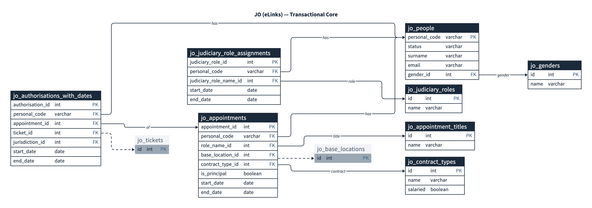

# JO (eLinks) Integration — CTAM ER Diagram

Source system: **Judicial Office eLinks** (backed by JHR — Judicial HR). All CTAM tables that hold a replicated copy of eLinks data use the `jo_` prefix. The full column-level source→CTAM mapping is in [jo-schema-mapping.md](./jo-schema-mapping.md).

## Conventions

- **Transactional** tables (white in source diagram): person and the things owned by a person (appointments, judiciary role assignments, authorisations).
- **Reference** tables (blue in source diagram): lookup data refreshed from the `/reference_data/*` endpoints.
- All reference and many transactional rows carry the source's own integer `id` — CTAM preserves that as the primary key so foreign keys keep working across refreshes (the source guarantees these `id`s are stable across releases and environments).
- `jo_people` is keyed by `personal_code` — the only attribute the source guarantees is unique and never reused (do **not** key on `id`, `email` or `per_id`).
- Deprecated source attributes (`per_id`, `sex`, the old flat `authorisations` array) are excluded.

## Naming clash — note

The source has a transactional `judiciary_roles[]` array on `/people` **and** a reference endpoint `/reference_data/judiciary_roles`. To avoid a table-name clash in CTAM:

| Source | CTAM table |
|---|---|
| `people.judiciary_roles[]` (transactional assignment) | `jo_judiciary_role_assignments` |
| `/reference_data/judiciary_roles` (lookup) | `jo_judiciary_roles` |

This is the only deviation from a strict 1:1 source→CTAM name mapping.

## Sync metadata

Per the agreed approach, refresh-status columns (`last_synced_at`, page cursor, last error, etc.) live in a **single side table** `jo_sync_status` keyed by source endpoint — they are not duplicated on every functional table. Source-provided `created_at` / `updated_at` are kept on the tables that the source exposes them on, because they describe the source row (not CTAM's sync).

---

## Diagrams

The diagrams are authored in **D2** (`.d2` sources) with rendered `.png` and `.svg` outputs alongside. D2 is used (in preference to PlantUML/Mermaid) because it connects foreign keys **field-to-field** — `jo_appointments.base_location_id -> jo_base_locations.id` — so every relationship attaches to its own row on the table (the OmniGraffle "multiple magnet" principle). Combined with the ELK layout engine, lines route orthogonally and stop criss-crossing.

The 16-table schema is split into focused **cluster views** plus one **full** reference view. Cross-cluster foreign keys appear as dashed/grey **external stub** boxes (key field only) so each cluster is self-contained while signposting where the full table lives.

| Diagram | Source | Rendered | Description |
|---|---|---|---|
| Transactional core | [`diagrams/jo-er-core.d2`](./diagrams/jo-er-core.d2) | [`png`](./diagrams/jo-er-core.png) · [`svg`](./diagrams/jo-er-core.svg) | `jo_people` and its direct children + person/appointment lookups — the most useful slice for day-to-day JOH queries. |
| Location cluster | [`diagrams/jo-er-location.d2`](./diagrams/jo-er-location.d2) | [`png`](./diagrams/jo-er-location.png) · [`svg`](./diagrams/jo-er-location.svg) | `jo_locations`, `jo_base_locations`, `jo_location_types`. |
| Ticket cluster | [`diagrams/jo-er-ticket.d2`](./diagrams/jo-er-ticket.d2) | [`png`](./diagrams/jo-er-ticket.png) · [`svg`](./diagrams/jo-er-ticket.svg) | `jo_tickets`, `jo_ticket_categories`, `jo_ticket_category_types`, incl. the Courts edge case. |
| Reference hub | [`diagrams/jo-er-reference-hub.d2`](./diagrams/jo-er-reference-hub.d2) | [`png`](./diagrams/jo-er-reference-hub.png) · [`svg`](./diagrams/jo-er-reference-hub.svg) | `jo_jurisdictions` fan-out to all consumers + standalone `jo_sync_status`. |
| Full ER diagram | [`diagrams/jo-er-full.d2`](./diagrams/jo-er-full.d2) | [`png`](./diagrams/jo-er-full.png) · [`svg`](./diagrams/jo-er-full.svg) | All 16 tables — transactional, reference and sync, on one canvas. |

### Quick preview



For the full diagram, open [`diagrams/jo-er-full.png`](./diagrams/jo-er-full.png).

### Re-rendering after edits

D2 is required on PATH (`brew install d2`). From anywhere:

```bash
scripts/render-jo-er-diagrams.sh
```

This re-renders all five diagrams to both PNG and SVG using `D2_LAYOUT=elk`. After re-rendering, regenerate the Confluence HTML (see [`confluence/README.md`](./confluence/README.md)) so the embedded images stay in sync.
